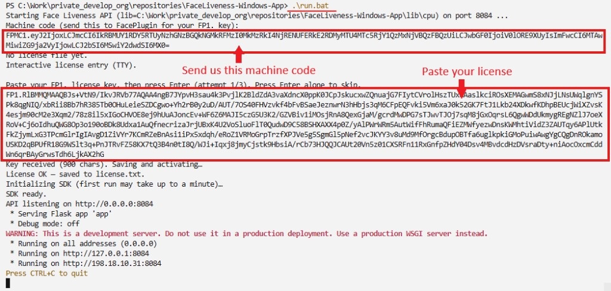

<div align="center">

</div>

#### 🌐 Company Site - [Here](https://faceplugin.com)
#### 🤗 Hugging Face - [Here](https://huggingface.co/FacePlugin-Ltd)
#### 🛟 Help Center - [Here](https://doc.faceplugin.com)
#### 🐳 Docker Hub - [Here](https://hub.docker.com/u/faceplugin)

# FacePlugin Face Liveness SDK — Windows (Fully On-Premise)

> **Ready in ~10 minutes (after Drive download):** put runtime under `lib\cpu\` → `run.bat` → copy `FPMC1.…` → `curl /api/health`.  
> Jump: [Quick Start](#quick-start) · [Start the API](#start-the-api) · [SDK License](#sdk-license) · [Setup on your own app](#setup-on-your-own-app) · [Try it](#try-it)

## Quick Start

- [ ] Clone [FaceLivenessDetection-Windows](https://github.com/Faceplugin-ltd/FaceLivenessDetection-Windows)
- [ ] Download the CPU runtime into `lib\cpu\` — [Get the runtime](#get-the-runtime)
- [ ] `pip install -r requirements.txt` then `run.bat` — API on **8084**
- [ ] Copy machine code `FPMC1.…` from the terminal (or `GET /api/machinecode`)
- [ ] [Contact us](#contact) to obtain a license key → enter it at the prompt or use `POST /api/activate`
- [ ] Try Postman, curl, or Gradio on **9004** (`run_demo.bat` — local only)

No Docker on Windows. For Docker, use [FaceLivenessDetection-Docker](https://github.com/Faceplugin-ltd/FaceLivenessDetection-Docker).

## Introduction

FacePlugin **Face Liveness SDK for Windows** is a fully on-premise anti-spoofing engine for KYC and remote identity verification. It scores a single RGB face image for presentation attacks — printed photos, screens, printouts, and video replay — and returns Real / Spoof with a pass score.

This repository is **standalone**. Download the Windows runtime into this repo and run — **no other FacePlugin repository is required**.

All processing stays on your machine. **No** biometric data is sent to FacePlugin cloud — built for banking, eKYC, and on-premise compliance workflows.

**Windows** product: native x64 runtime, local HTTP API, and a Gradio demo. **CPU-only**.

Test with Postman, curl, or the local Gradio demo (`demo.py`). Docs: [https://doc.faceplugin.com](https://doc.faceplugin.com).

### Main Functionalities

| Feature | API |
| ------- | --- |
| RGB face liveness (all engines combined) | `POST /api/liveness` · `sdk.liveness` |
| Photo, screen, print, and replay presentation-attack detection | same call |
| Score, Real/Spoof, pass | `data.score` · `data.result` · `data.pass` |
| Health / machine code / activate | `GET /api/health` · `GET /api/machinecode` · `POST /api/activate` |

Score **≥ 0.5** → `result: "Real"`, `pass: true`. Score **< 0.5** → `result: "Spoof"`, `pass: false`.

`POST /api/check_liveness` is an alias of `/api/liveness`.

### Product List

| Platform | Repository |
|----------|------------|
| Android (Recognition) | [FaceRecognition-Android](https://github.com/Faceplugin-ltd/FaceRecognition-Android) |
| iOS (Recognition) | [FaceRecognition-iOS](https://github.com/Faceplugin-ltd/FaceRecognition-iOS) |
| React Native (Recognition) | [FaceRecognition-React-Native](https://github.com/Faceplugin-ltd/FaceRecognition-React-Native) |
| Flutter (Recognition) | [FaceRecognition-Flutter](https://github.com/Faceplugin-ltd/FaceRecognition-Flutter) |
| Ionic Capacitor (Recognition) | [FaceRecognition-Ionic-Capacitor](https://github.com/Faceplugin-ltd/FaceRecognition-Ionic-Capacitor) |
| Ionic Cordova (Recognition) | [FaceRecognition-Ionic-Cordova](https://github.com/Faceplugin-ltd/FaceRecognition-Ionic-Cordova) |
| Windows (Recognition) | [FaceRecognition-Windows](https://github.com/Faceplugin-ltd/FaceRecognition-Windows) |
| Linux / Docker (Recognition) | [FaceRecognition-Docker](https://github.com/Faceplugin-ltd/FaceRecognition-Docker) |
| Android (Liveness) | [FaceLivenessDetection-Android](https://github.com/Faceplugin-ltd/FaceLivenessDetection-Android) |
| iOS (Liveness) | [FaceLivenessDetection-iOS](https://github.com/Faceplugin-ltd/FaceLivenessDetection-iOS) |
| **Windows (Liveness)** | **[FaceLivenessDetection-Windows](https://github.com/Faceplugin-ltd/FaceLivenessDetection-Windows)** (**this repo**) |
| Linux / Docker (Liveness) | [FaceLivenessDetection-Docker](https://github.com/Faceplugin-ltd/FaceLivenessDetection-Docker) |


## Before you start

| Step | What you need |
|------|----------------|
| 1 | Windows 10/11 **x64**, Python 3.10+ |
| 2 | Runtime libraries in `.\lib\cpu\` — see [Get the runtime](#get-the-runtime) |
| 3 | Start **without** a license. Copy `FPMC1.…` from the log or `GET /api/machinecode`, send it to FacePlugin ([contact](#contact)), then activate with your license key |

You do **not** need a license to start the API once. Product endpoints unlock after you activate.

### System requirements

| Item | Minimum | Recommended |
|------|---------|-------------|
| OS | Windows 10 x64 | Windows 11 x64 |
| CPU | 4 cores | 8 cores |
| RAM | 4 GB | 8 GB |
| Disk | 4 GB | 8 GB |
| Python | 3.10+ | 3.12 |

## Start the API

### Get the runtime

`.\lib\cpu\` is empty on GitHub because native binaries and model files are too large. The Windows product is **CPU-only** — there is no `gpu\` package.

**[FaceLiveness-Windows runtime (Google Drive)](https://drive.google.com/drive/folders/11xD987eHT00NUGiJZCNYSvwRadi0Nue5)**

1. Clone the repo (if you have not already):

```bat
git clone https://github.com/Faceplugin-ltd/FaceLivenessDetection-Windows.git
cd FaceLivenessDetection-Windows
```

2. Open the Google Drive folder above.
3. Download **all files** in that folder (Drive: select all → Download, or download as a zip).
4. Put every file **directly** into `.\lib\cpu\` — not inside a nested subfolder.

```text
FaceLivenessDetection-Windows/
└── lib/
    └── cpu/
        ├── FaceLivenessSDK.dll
        ├── fal-eng.dll
        ├── fal.fpk
        └── ... (VC++ redist and other runtimes from Drive)
```

Wrong layout: `lib\cpu\SomeFolder\FaceLivenessSDK.dll` (a nested folder breaks local runs).

```bat
dir lib\cpu\FaceLivenessSDK.dll
dir lib\cpu\fal-eng.dll
dir lib\cpu\fal.fpk
```

If those paths exist, you are ready to start. The VC++ runtime DLLs ship **inside** `lib\cpu\`. You do **not** install `vcredist`. `run.bat` puts that folder on `PATH`.

### Run

You can start **without** a license — the server prints your machine code on startup.

```bat
pip install -r requirements.txt
run.bat
```

API: **http://127.0.0.1:8084**

The API starts even if activation fails. Copy the **machine code** (`FPMC1.…`) from the log and send it to FacePlugin. When prompted, paste your **license key** (or skip and activate later).

<p align="center">
 
</p>

## SDK License

Licenses are **offline** and bound to your machine. Offline cryptography is pre-packaged within the SDK—no third-party licensing libraries or external OpenSSL installations are required.

### How to get a license

1. **Start the server** ([above](#start-the-api)). A license is not required for the first start.
2. **Copy the machine code** from the terminal. It looks like **`FPMC1.…`**.
3. **Send that machine code** to FacePlugin ([contact](#contact)). We will issue a license key for that code.
4. **Activate** with the license key — either paste it when `run.bat` prompts you (see screenshot above), or:

```bat
:: After run.bat, paste the license key on the terminal like the screenshot. You can try 3 times.

:: Or paste the license key into .\license.txt (overwrite the file), then:

curl -s -X POST http://127.0.0.1:8084/api/activate -H "Content-Type: text/plain" --data-binary @license.txt

:: Or stop the process (Ctrl+C), save license.txt, and run run.bat again
```

## Try it

### Health

```bat
curl -s http://127.0.0.1:8084/api/health
```

### Liveness

```bat
curl -s -X POST http://127.0.0.1:8084/api/liveness -H "Content-Type: application/json" -d "{\"image\":\"<base64-jpeg>\"}"
```

Success `data`:

```json
{ "score": 0.72, "result": "Real", "pass": true }
```

### Documentation

[https://doc.faceplugin.com](https://doc.faceplugin.com)

### Postman

Import [`postman/FaceLiveness-API.postman_collection.json`](postman/FaceLiveness-API.postman_collection.json).

Default base URL: `http://127.0.0.1:8084`

Routes are `/api/*` (no version segment in paths).

### Demo UI (Gradio) — local only

For a local FacePlugin Face Liveness demo in the browser — Real / Spoof score and Pass (API must already be running on port 8084):

```bat
pip install -r requirements-demo.txt
run_demo.bat
```

Or (CMD):

```bat
set DEMO_PORT=9004
set API_BASE=http://127.0.0.1:8084
python demo.py
```

PowerShell:

```powershell
$env:DEMO_PORT = "9004"
$env:API_BASE = "http://127.0.0.1:8084"
python demo.py
```

Open **http://127.0.0.1:9004**. Samples: `assets/examples/samples/`.

Each run shows **Score**, **Result** (`Real` or `Spoof`), and **Pass** for presentation-attack detection.

<p align="center">
 
</p>

## Setup on your own app

Two ways to call the same engine. Full protocol: [https://doc.faceplugin.com](https://doc.faceplugin.com).

| Path | When to use |
| ---- | ----------- |
| **HTTP** (`app.py` via `run.bat`) | Any language. Keep this API running and `POST` a base64 JPEG. |
| **`sdk.py`** | Python on the **same** Windows machine as `lib\cpu\`. No HTTP hop. |

**HTTP (any language):** start the API, then `POST /api/liveness` with `{"image":"<base64-jpeg>"}`. See [Try it](#try-it) and Postman.

**Python in-process:** copy `sdk.py` + `lib\cpu\` into your project (or `import sdk` from this repo). Put `lib\cpu` on `PATH`. Call order: `get_machine_code` → `activate` → `init_sdk` → `liveness`. Return code `0` means success.

You do **not** need Gradio (`demo.py` / `run_demo.bat`) in production — it is a local test UI.

## About SDK

Use the Python bindings in [`sdk.py`](sdk.py). Return code `0` means success.

```python
import sdk

machine_code = sdk.get_machine_code()  # FPMC1.…
sdk.activate("license.txt")
sdk.init_sdk()
result = sdk.liveness(base64_image)
```

`result` is JSON. `data` is `{ "score": <float>, "result": "Real" | "Spoof", "pass": <bool> }`. All RGB engines are always run and combined.

HTTP endpoints: `/api/health`, `/api/machinecode`, `/api/backend`, `/api/activate`, `/api/liveness`, `/api/check_liveness`.

## Contact

<div align="left">
<a target="_blank" href="mailto:info@faceplugin.com"></a>&emsp;
<a target="_blank" href="https://wa.me/+14692784822"></a>
</div>
